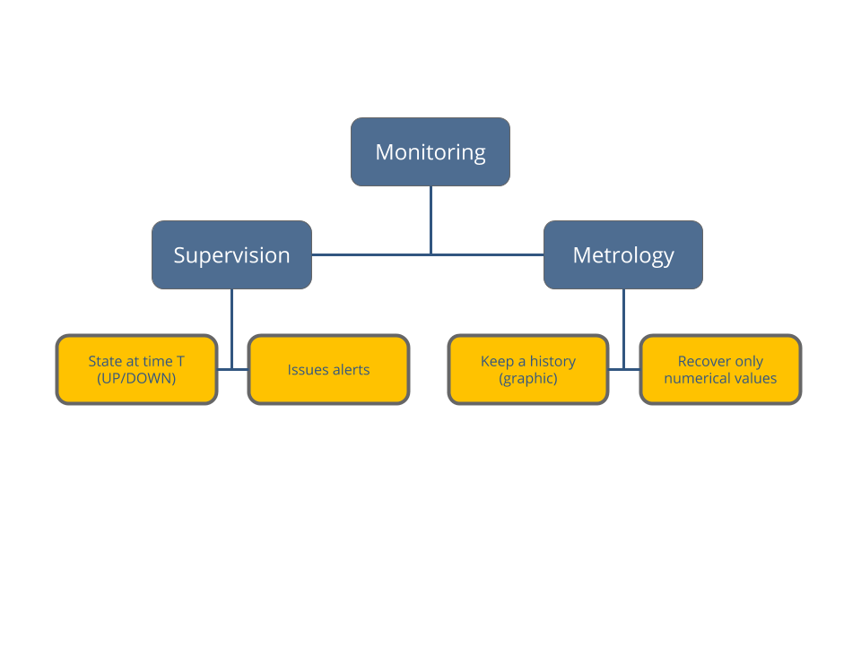
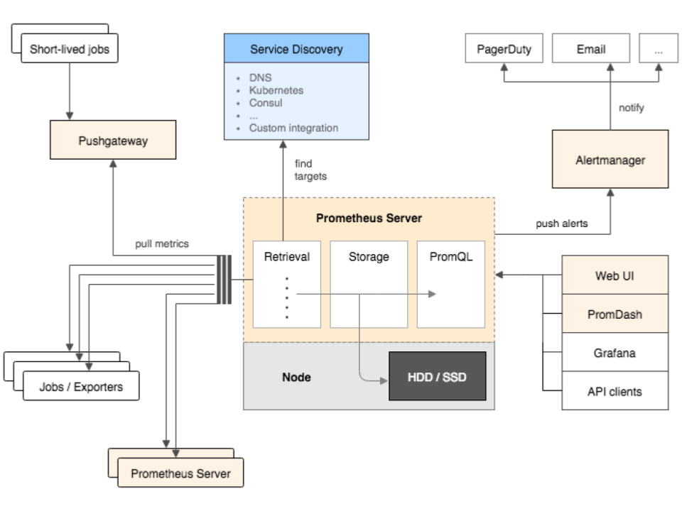

theme: XebiCon18
slidenumbers: true

## XebiCon'__18__

## How to monitor a __NodeJS__ app inside a __container__

---

# Who am I?

Paul-Guillaume Déjardin

**@pgdejardin**

Backend / Frontend developer

---

# Agenda

- Monitoring?
- **Prometheus**
- **Grafana**
- In my **NodeJS** application

---

# What is Monitoring?

---

---

# Prometheus

---

---
